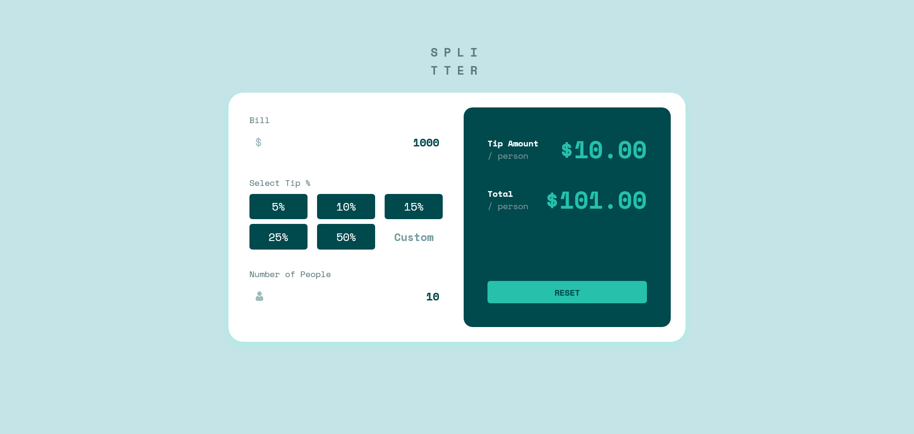
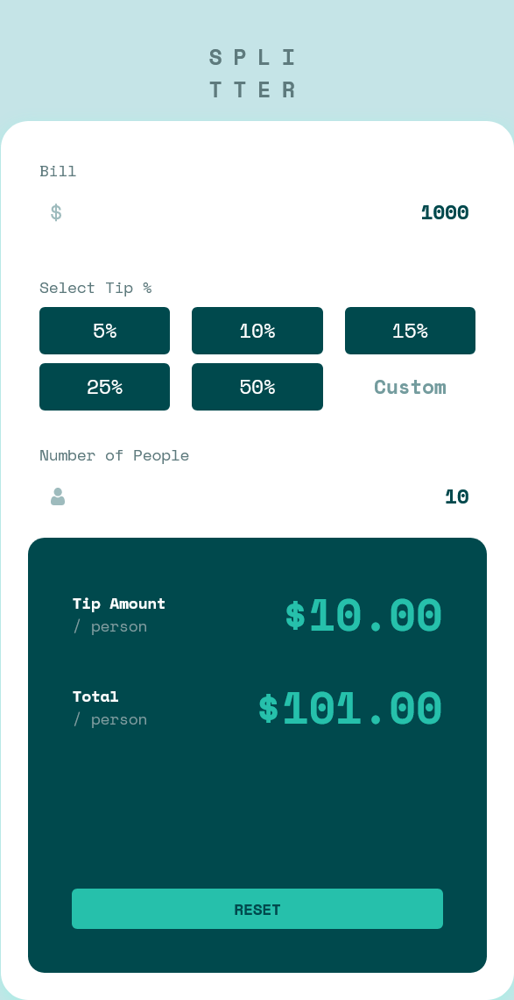

# Frontend Mentor - Tip calculator app solution

This is a solution to the [Tip calculator app challenge on Frontend Mentor](https://www.frontendmentor.io/challenges/tip-calculator-app-ugJNGbJUX).

### Links

- Solution URL: [Project Github Link](https://github.com/mmubashshir/bill-splitter)
- Live Site URL: [Bill Splitter App](https://mmubashshir.github.io/bill-splitter/)

## Table of contents

- [Overview](#overview)
  - [The challenge](#the-challenge)
  - [Screenshot](#screenshot)
  - [Links](#links)
- [My process](#my-process)
  - [Built with](#built-with)
  - [What I learned](#what-i-learned)
  - [Useful resources](#useful-resources)
- [Author](#author)

## Overview

### The challenge

Users should be able to:

- View the optimal layout for the app depending on their device's screen size
- See hover states for all interactive elements on the page
- Calculate the correct tip and total cost of the bill per person

### Screenshot

## My process

### Built with

- Semantic HTML5 markup
- CSS custom properties
- Flexbox
- CSS Grid

### What I learned

I had a great learning of DOM, since it involved capturing of different input and updating the tip and total bill amount per person. Also made efforts to know about the event listeners in detail. I wasnot sure how to make a custom styled input, had a little understanding around styles for input.

### Useful resources

- [Reset without using form](https://stackoverflow.com/questions/62650410/adding-a-reset-button-in-javascript) - I wasn't sure how to make a custom reset button. I became where how to rest values of inuput area and display area.
- [W3 Schools DOM](https://www.w3schools.com/js/js_htmldom.asp) - Refered working of DOM
- [W3 Schools Event Listener](https://www.w3schools.com/js/js_htmldom_eventlistener.asp) - Refered working of Event Listener.

## Author

- Frontend Mentor - [@mmubashshir](https://www.frontendmentor.io/profile/mmubashshir)
- Github - [@mmubashshir](http://github.com/mmubashshir)
- Twitter - [@MubashshirMir](https://twitter.com/MubashshirMir)
